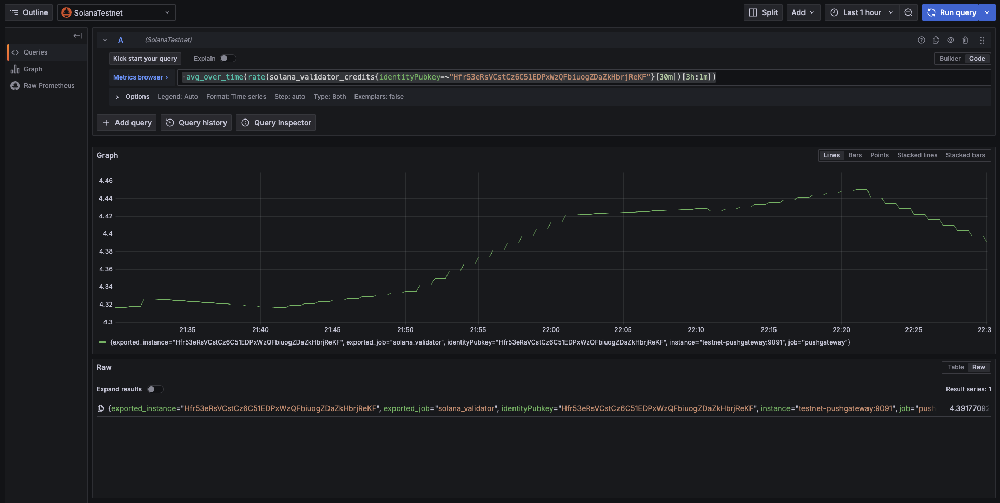

# Solana Monitor

This is a simple Solana metric monitor to monitor metrics about the Solana Network. It uses the Solana RPC API to get the metrics, stores them in Prometheus and graphs them using Grafana.

## Getting Started

Simply run the docker compose

```bash
docker-compose up
```

Navigate to `http://localhost:3000` to view the Grafana dashboard. The default username and password is `admin`.

Use a query like below to graph vote rate for specific validators over time.

```promql
 avg_over_time(rate(solana_validator_credits{identityPubkey=~"Hfr53eRsVCstCz6C51EDPxWzQFbiuogZDaZkHbrjReKF"}[30m])[3h:1m])
```


